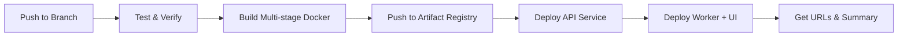

# 🚀 GitHub Actions CI/CD Setup Guide

## Overview

Your existing GitHub Actions workflow (`.github/workflows/deploy.yml`) has been **upgraded** to support:

1. ✅ **Multi-stage Docker builds** (Node.js frontend + Python backend)
2. ✅ **Bundled React UI** (War Room Dashboard served from worker)
3. ✅ **Automated deployment** to Google Cloud Run
4. ✅ **Separate staging and production** environments

---

## 📋 Prerequisites Checklist

### 1. Google Cloud Setup

Ensure you have the following GCP resources configured:

- **Project ID**: `web3-xdr` ✅
- **Region**: `us-central1` ✅
- **Artifact Registry**: `web3-xdr-repo` (Docker image repository)
- **Service Account**: With permissions for Cloud Run and Artifact Registry

### 2. Required GitHub Secrets

You need to configure **ONE** GitHub secret:

| Secret Name | Description | How to Get |
|------------|-------------|------------|
| `GCP_SA_KEY` | Google Cloud Service Account JSON key | See instructions below |

---

## 🔐 Step-by-Step: Configure GitHub Secrets

### Step 1: Create GCP Service Account (if not exists)

```bash
# Set your project
gcloud config set project web3-xdr

# Create service account
gcloud iam service-accounts create github-actions \
  --display-name="GitHub Actions Deployment" \
  --description="Service account for CI/CD deployments"

# Grant required permissions
gcloud projects add-iam-policy-binding web3-xdr \
  --member="serviceAccount:github-actions@web3-xdr.iam.gserviceaccount.com" \
  --role="roles/run.admin"

gcloud projects add-iam-policy-binding web3-xdr \
  --member="serviceAccount:github-actions@web3-xdr.iam.gserviceaccount.com" \
  --role="roles/artifactregistry.writer"

gcloud projects add-iam-policy-binding web3-xdr \
  --member="serviceAccount:github-actions@web3-xdr.iam.gserviceaccount.com" \
  --role="roles/iam.serviceAccountUser"

gcloud projects add-iam-policy-binding web3-xdr \
  --member="serviceAccount:github-actions@web3-xdr.iam.gserviceaccount.com" \
  --role="roles/secretmanager.secretAccessor"
```

### Step 2: Create and Download JSON Key

```bash
# Create key
gcloud iam service-accounts keys create github-actions-key.json \
  --iam-account=github-actions@web3-xdr.iam.gserviceaccount.com

# Display the key (copy this entire JSON output)
cat github-actions-key.json
```

### Step 3: Add Secret to GitHub

1. Go to your repository: **https://github.com/vaibhav3104/web3-xdr**
2. Navigate to **Settings → Secrets and variables → Actions**
3. Click **"New repository secret"**
4. Name: `GCP_SA_KEY`
5. Value: Paste the **entire JSON** from `github-actions-key.json`
6. Click **"Add secret"**

### Step 4: Verify GCP Secrets Manager

Ensure the following secrets exist in GCP Secret Manager:

```bash
# List existing secrets
gcloud secrets list

# Required secrets:
# - web3-xdr-infura-api-key
# - web3-xdr-jwt-secret
# - web3-xdr-openai-api-key
# - web3-xdr-database-url
# - web3-xdr-redis-url
```

If any are missing, create them:

```bash
# Example: Create a secret
echo -n "your-secret-value" | gcloud secrets create web3-xdr-infura-api-key --data-file=-
```

### Step 5: Create Artifact Registry Repository (if not exists)

```bash
# Create Artifact Registry repository
gcloud artifacts repositories create web3-xdr-repo \
  --repository-format=docker \
  --location=us-central1 \
  --description="Web3 XDR Docker images"
```

---

## 🎯 How the Workflow Works

### Branching Strategy

| Branch | Environment | Trigger | Services Deployed |
|--------|-------------|---------|-------------------|
| `develop` | **Staging** | Push | `web3-xdr-api`, `web3-xdr-worker` |
| `main` | **Production** | Push | `web3-xdr-production-api`, `web3-xdr-production-worker` |

### Workflow Stages



#### Stage 1: Test & Verify

- ✅ Installs Python dependencies
- ✅ Validates Python imports
- ✅ Builds React frontend (verification)
- ✅ Runs pytest suite
- ✅ Verifies Dockerfile structure

#### Stage 2: Build Multi-stage Docker

The `Dockerfile` has two stages:

1. **Frontend Builder** (`node:18-alpine`)
   - Installs npm dependencies
   - Runs `npm run build` in `frontend/war-room`
   - Produces `dist/` folder

2. **Python Runtime** (`python:3.11-slim`)
   - Copies built frontend assets to `/app/static`
   - Installs Python dependencies
   - Bundles everything into one image

#### Stage 3: Deploy to Cloud Run

- **API Service**: Traditional REST API (port 8080)
- **Worker Service**: Runtime engine + WebSocket + **Bundled UI** (port 9090)
  - Now **publicly accessible** (`--allow-unauthenticated`)
  - Serves React UI from root path `/`
  - Exposes `/health`, `/metrics`, `/ws` endpoints

---

## 🚀 Deploying Your Application

### Option 1: Deploy to Staging (Recommended for Testing)

```bash
# Commit your changes
git add .
git commit -m "Deploy bundled UI to staging"

# Push to develop branch
git checkout develop  # or: git checkout -b develop
git push origin develop
```

**What happens:**
- GitHub Actions triggers automatically
- Builds and deploys to **staging** environment
- Services: `web3-xdr-api`, `web3-xdr-worker`
- Check the "Actions" tab for deployment progress

### Option 2: Deploy to Production

```bash
# Ensure main branch is up to date
git checkout main
git merge develop  # or cherry-pick your changes

# Push to main
git push origin main
```

**What happens:**
- GitHub Actions triggers automatically
- Builds and deploys to **production** environment
- Services: `web3-xdr-production-api`, `web3-xdr-production-worker`

---

## 🔍 Monitoring Deployment

### View Deployment Progress

1. Go to **https://github.com/vaibhav3104/web3-xdr/actions**
2. Click on the latest workflow run
3. Monitor each stage in real-time
4. Check the **Summary** tab for deployment URLs

### Check Deployment Summary

After successful deployment, GitHub Actions will display:

```
## 🚀 Production Deployment Successful!

**Environment:** Production
**API URL:** https://web3-xdr-production-api-abc123.run.app
**Worker URL (with UI):** https://web3-xdr-production-worker-xyz789.run.app
**War Room UI:** https://web3-xdr-production-worker-xyz789.run.app/
**Health Check:** https://web3-xdr-production-worker-xyz789.run.app/health
**Metrics:** https://web3-xdr-production-worker-xyz789.run.app/metrics
**Image:** `abc123def456...`

✅ **Frontend:** React War Room UI bundled and deployed
```

---

## 🧪 Testing Your Deployment

### 1. Health Check

```bash
# Replace with your actual URL
curl https://web3-xdr-worker-xyz789.run.app/health
```

**Expected Response:**

```json
{
  "status": "healthy",
  "timestamp": "2026-01-09T12:34:56Z",
  "service": "web3-xdr-worker"
}
```

### 2. Access War Room UI

Open in browser:

```
https://web3-xdr-worker-xyz789.run.app/
```

**You should see:**
- 🎨 React War Room Dashboard
- 📊 Live metrics
- 🌐 Cross-chain graph
- 🚨 Threat feed

### 3. WebSocket Connection

```javascript
// Test WebSocket in browser console
const ws = new WebSocket('wss://web3-xdr-worker-xyz789.run.app/ws');
ws.onmessage = (event) => console.log('Received:', JSON.parse(event.data));
```

---

## 🐛 Troubleshooting

### Issue: "Unauthorized" Error During Deployment

**Cause**: `GCP_SA_KEY` secret is invalid or missing permissions.

**Fix**:
1. Verify the service account has all required roles
2. Regenerate the JSON key
3. Update the GitHub secret

### Issue: Docker Build Fails at Frontend Stage

**Cause**: Missing `package-lock.json` or npm dependency issues.

**Fix**:

```bash
cd frontend/war-room
npm install  # Regenerate package-lock.json
git add package-lock.json
git commit -m "Add package-lock.json"
git push
```

### Issue: UI Shows 404 for `/assets/*`

**Cause**: Static files not copied correctly in Dockerfile.

**Fix**: Verify your `Dockerfile` has:

```dockerfile
# Stage 1: Build frontend
FROM node:18-alpine AS frontend-builder
WORKDIR /build
COPY frontend/war-room/package*.json ./
RUN npm ci
COPY frontend/war-room/ ./
RUN npm run build

# Stage 2: Copy built assets
FROM python:3.11-slim
COPY --from=frontend-builder /build/dist /app/static
```

### Issue: Worker Service Not Accessible

**Cause**: Worker was deployed with `--no-allow-unauthenticated`.

**Fix**: Redeploy with public access:

```bash
gcloud run services update web3-xdr-worker \
  --region us-central1 \
  --allow-unauthenticated
```

---

## 📊 Cost Optimization

### Staging Environment

- **Min Instances**: 1 (always warm)
- **Max Instances**: 3
- **Memory**: 4GB (Worker), 2GB (API)
- **Estimated Cost**: ~$50-100/month

### Production Environment

- **Min Instances**: 1
- **Max Instances**: 10 (API), 3 (Worker)
- **Memory**: 4GB (Worker), 2GB (API)
- **Estimated Cost**: ~$100-200/month (depending on traffic)

### Reduce Costs

To reduce costs for staging:

```bash
# Scale down staging when not in use
gcloud run services update web3-xdr-worker \
  --region us-central1 \
  --min-instances 0
```

---

## 🎉 Next Steps

1. ✅ **Configure GitHub Secrets** (see Step-by-Step section)
2. ✅ **Push to `develop` branch** to deploy to staging
3. ✅ **Test the UI** at the worker URL
4. ✅ **Verify WebSocket connection** works
5. ✅ **Merge to `main`** for production deployment

---

## 📚 Additional Resources

- **GitHub Actions Workflow**: `.github/workflows/deploy.yml`
- **Dockerfile**: `Dockerfile` (multi-stage build)
- **Worker Code**: `src/worker/main.py` (aiohttp + static files)
- **Frontend**: `frontend/war-room/` (React + Vite)

---

## 🆘 Need Help?

If you encounter issues:

1. Check the **Actions** tab for error logs
2. Review **Cloud Run logs** in GCP Console
3. Verify all secrets are correctly configured
4. Ensure Artifact Registry repository exists

---

**Status**: ✅ **READY TO DEPLOY**

Your GitHub Actions workflow is fully configured and ready to deploy your bundled application to Google Cloud Run!
