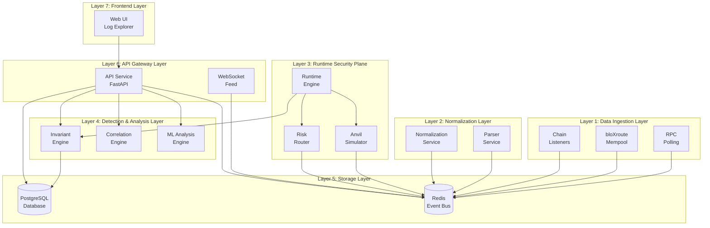
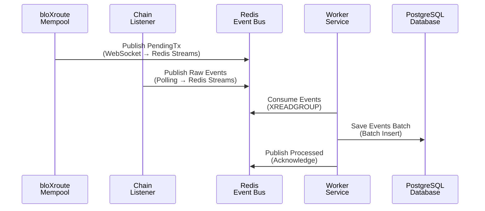
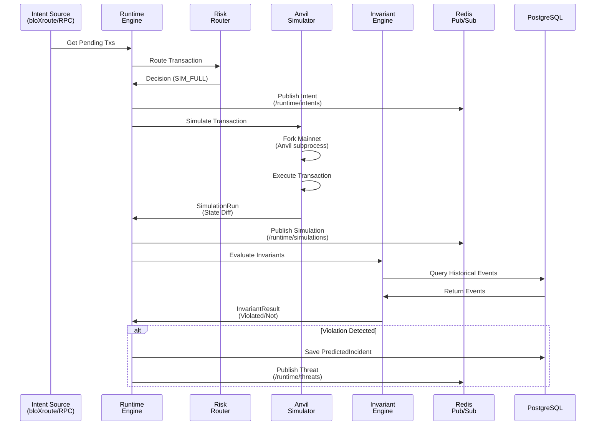
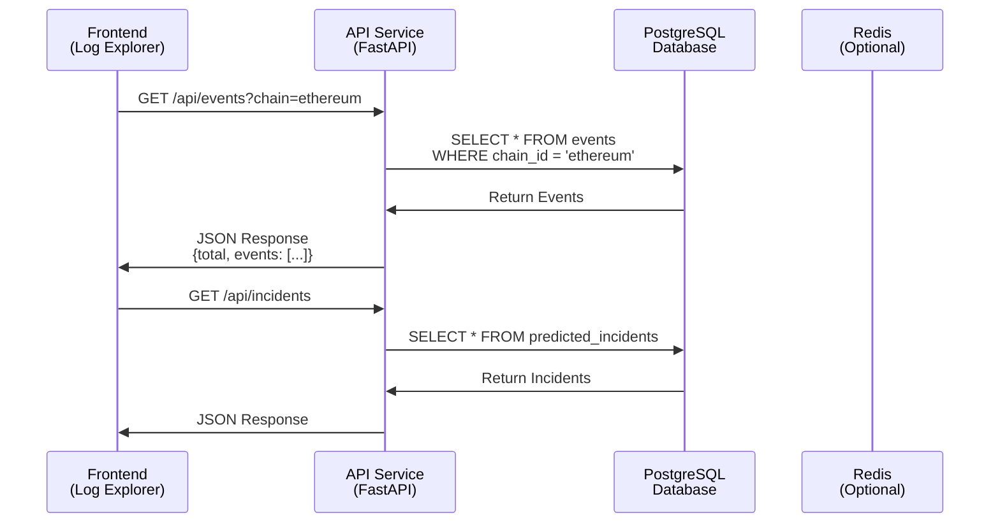
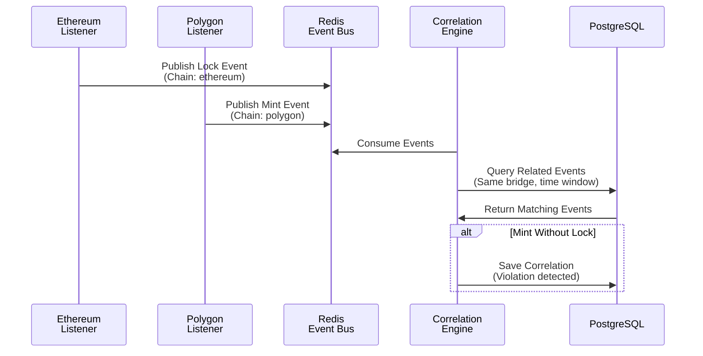
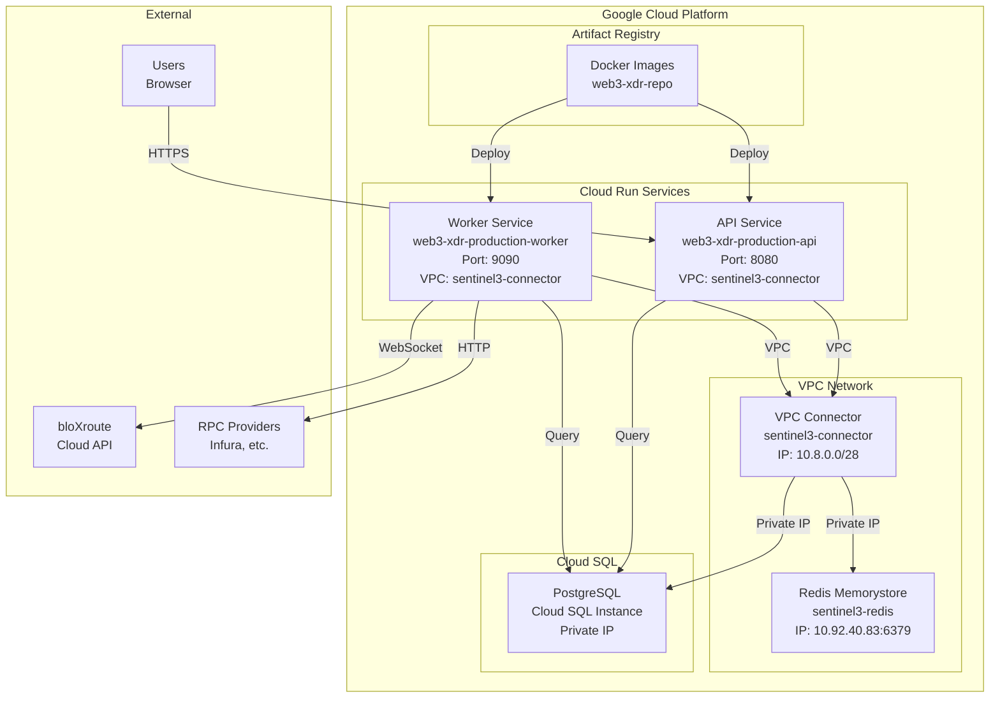

# 🏗️ Sentinel3 System Blueprint - Layer-Wise Architecture

## 📋 Table of Contents
1. [System Overview](#system-overview)
2. [Layer Architecture](#layer-architecture)
3. [Microservices & Components](#microservices--components)
4. [Communication Patterns](#communication-patterns)
5. [Data Flow Diagrams](#data-flow-diagrams)
6. [Deployment Architecture](#deployment-architecture)

---

## 🎯 System Overview

Sentinel3 is a **runtime security plane** for cross-chain bridge attack detection, built as a **distributed microservices architecture** with **7 layers** and **15+ microservices/components**.

### Core Mission
Detect cross-chain bridge attacks (e.g., Mint-without-Lock) by monitoring the **Mempool** (0-block detection) and enforcing **Economic Invariants**.

---

## 🏛️ Layer Architecture

---

## 🔧 Microservices & Components

### Layer 1: Data Ingestion Layer

#### 1.1 bloXroute Mempool Source (`BloxrouteMempoolSource`)
- **Type**: Microservice Component
- **Location**: `src/runtime/intent_sources/bloxroute_source.py`
- **Purpose**: Real-time mempool monitoring (0-block detection)
- **Protocol**: WebSocket
- **Output**: `PendingTx` events → Redis Streams

#### 1.2 RPC Polling Service (`MultiRpcProvider`)
- **Type**: Microservice Component
- **Location**: `src/telemetry/rpc_client.py`
- **Purpose**: Poll confirmed blocks from multiple RPC endpoints
- **Protocol**: HTTP/HTTPS (JSON-RPC)
- **Output**: Block data → Chain Listeners

#### 1.3 Chain Listeners (`EVMListener`, `SolanaListener`, etc.)
- **Type**: Microservice Component
- **Location**: `src/telemetry/evm_listener.py`
- **Purpose**: Chain-specific event extraction
- **Protocol**: WebSocket (preferred) or Polling
- **Output**: Raw events → Normalization Layer

#### 1.4 Finality Tracker (`FinalityTrackerManager`)
- **Type**: Microservice Component
- **Location**: `src/telemetry/finality_tracker.py`
- **Purpose**: Track block finality across chains
- **Protocol**: Internal (in-memory)
- **Output**: Finality status → Event Bus

---

### Layer 2: Normalization Layer

#### 2.1 Normalization Service (`NormalizationEngine`)
- **Type**: Microservice Component
- **Location**: `src/normalization/`
- **Purpose**: Convert chain-specific events to standard format
- **Input**: Raw chain events
- **Output**: `SecurityEvent` → Redis Event Bus

#### 2.2 Parser Service (`ParserManager`)
- **Type**: Microservice Component
- **Location**: `src/parsers/`
- **Purpose**: Parse contract ABIs and extract event data
- **Input**: Raw logs + Contract ABIs
- **Output**: Parsed events → Normalization Service

---

### Layer 3: Runtime Security Plane

#### 3.1 Runtime Engine (`RuntimeEngine`)
- **Type**: Core Orchestrator
- **Location**: `src/runtime/runtime_engine.py`
- **Purpose**: Orchestrate runtime security checks
- **Flow**: Source → Router → Simulator → Invariant → Incident
- **Communication**: 
  - Consumes: Redis Streams (pending transactions)
  - Publishes: Redis Pub/Sub (simulation results, threats)

#### 3.2 Risk Router (`RiskRouter`)
- **Type**: Microservice Component
- **Location**: `src/runtime/risk_router.py`
- **Purpose**: Filter transactions (budget/whitelist/blacklist)
- **Input**: `PendingTx`
- **Output**: `RouterDecision` (IGNORE/HOT_ONLY/SIM_FAST/SIM_FULL)
- **Communication**: Internal (called by Runtime Engine)

#### 3.3 Anvil Simulator (`AnvilSimulator`)
- **Type**: Microservice Component
- **Location**: `src/runtime/simulator/anvil.py`
- **Purpose**: Fork mainnet and simulate transactions
- **Protocol**: HTTP (Anvil RPC)
- **Input**: `PendingTx` + Fork block
- **Output**: `SimulationRun` (state diff, gas used, etc.)
- **Communication**: 
  - Spawns: Anvil subprocess (local)
  - Communicates: HTTP to Anvil instance

#### 3.4 Intent Sources (`BloxrouteMempoolSource`, `PseudoIntentBlockSource`)
- **Type**: Microservice Component
- **Location**: `src/runtime/intent_sources/`
- **Purpose**: Provide pending transactions for simulation
- **Output**: `PendingTx` → Runtime Engine

---

### Layer 4: Detection & Analysis Layer

#### 4.1 Invariant Engine (`InvariantEngine`)
- **Type**: Microservice Component
- **Location**: `src/invariants/engine.py`
- **Purpose**: Check economic invariants (MintWithoutLock, TVLVelocity, etc.)
- **Input**: `SimulationRun` + Historical events
- **Output**: `InvariantResult` (violated/not violated)
- **Communication**: 
  - Reads: PostgreSQL (historical events)
  - Writes: PostgreSQL (violations)

#### 4.2 Correlation Engine (`CorrelationEngine`)
- **Type**: Microservice Component
- **Location**: `src/correlation/`
- **Purpose**: Cross-chain event correlation
- **Input**: Events from multiple chains
- **Output**: Correlated incidents
- **Communication**: 
  - Reads: PostgreSQL (events)
  - Writes: PostgreSQL (correlations)

#### 4.3 ML Analysis Engine (`MLAnalysisEngine`)
- **Type**: Microservice Component
- **Location**: `src/ml/`
- **Purpose**: ML-based anomaly detection
- **Input**: Event features
- **Output**: Anomaly scores
- **Communication**: 
  - Reads: PostgreSQL (events)
  - Writes: PostgreSQL (predictions)

---

### Layer 5: Storage Layer

#### 5.1 PostgreSQL Database (`DatabaseManager`, `DatabaseService`)
- **Type**: Persistent Storage
- **Location**: `src/database/`
- **Purpose**: Store events, incidents, simulations
- **Protocol**: PostgreSQL (async SQLAlchemy)
- **Tables**:
  - `events` - Security events
  - `predicted_incidents` - Detected threats
  - `simulation_runs` - Simulation results
  - `bridge_states` - Bridge state snapshots

#### 5.2 Redis Event Bus (`RedisStreamsBus`, `InMemoryBus`)
- **Type**: Message Queue / Pub/Sub
- **Location**: `src/pipeline/bus.py`
- **Purpose**: Decouple ingestion from processing
- **Protocol**: Redis Streams
- **Streams**:
  - `sentinel3:events` - Event bus
  - `sentinel3:runtime:intents` - Runtime intents
  - `sentinel3:runtime:simulations` - Simulation results
  - `sentinel3:runtime:threats` - Detected threats

#### 5.3 Redis State Manager (`RedisStateManager`)
- **Type**: Distributed State
- **Location**: `src/database/redis_manager.py`
- **Purpose**: Shared state across instances
- **Protocol**: Redis (atomic operations)
- **Data**: Lock/Mint correlations, bridge states

---

### Layer 6: API Gateway Layer

#### 6.1 API Service (`FastAPI Server`)
- **Type**: Microservice (Cloud Run)
- **Location**: `src/api/server.py`
- **Purpose**: REST API for frontend and integrations
- **Protocol**: HTTP/HTTPS (REST), WebSocket
- **Endpoints**:
  - `/api/events` - Query events
  - `/api/incidents` - Get incidents
  - `/api/runtime/*` - Runtime security endpoints
  - `/ws/feed` - WebSocket feed (removed - War Room)
- **Communication**:
  - Reads: PostgreSQL (events, incidents)
  - Writes: PostgreSQL (acknowledgments, updates)

#### 6.2 Worker Service (`Sentinel3Worker`)
- **Type**: Microservice (Cloud Run)
- **Location**: `src/worker/main.py`
- **Purpose**: Background processing (ingestion, detection, runtime)
- **Protocol**: HTTP (health/metrics endpoints)
- **Loops**:
  - `ingestion_loop()` - Poll chains, publish events
  - `detection_loop()` - Consume events, save to DB
  - `runtime_loop()` - Process runtime security plane
- **Communication**:
  - Publishes: Redis Streams (events)
  - Consumes: Redis Streams (events)
  - Writes: PostgreSQL (events, incidents)

---

### Layer 7: Frontend Layer

#### 7.1 Log Explorer (`logs.html`)
- **Type**: Static Web App
- **Location**: `frontend/logs.html`
- **Purpose**: Event exploration and filtering
- **Protocol**: HTTP (REST API calls)
- **Communication**: 
  - Reads: `/api/events` (REST)

#### 7.2 Dashboard (`index.html`)
- **Type**: Static Web App
- **Location**: `frontend/index.html`
- **Purpose**: Main dashboard with navigation
- **Protocol**: HTTP (REST API calls)
- **Communication**: 
  - Reads: `/api/events`, `/api/incidents` (REST)

---

## 🔄 Communication Patterns

### Pattern 1: Event Ingestion Flow

### Pattern 2: Runtime Security Flow

### Pattern 3: API Request Flow

### Pattern 4: Cross-Chain Correlation Flow

---

## 📊 Complete System Architecture Diagram

```mermaid
graph TB
    subgraph "External Sources"
        BLOX[bloXroute<br/>Cloud API<br/>WebSocket]
        RPC1[Ethereum<br/>RPC Nodes]
        RPC2[Polygon<br/>RPC Nodes]
        RPC3[Other Chains<br/>RPC Nodes]
    end
    
    subgraph "Layer 1: Data Ingestion"
        BLOX_SRC[BloxrouteMempoolSource<br/>0-block detection]
        LISTENER1[EVMListener<br/>Ethereum]
        LISTENER2[EVMListener<br/>Polygon]
        LISTENER3[Chain Listeners<br/>Other Chains]
        FINALITY[FinalityTrackerManager<br/>Block finality]
    end
    
    subgraph "Layer 2: Normalization"
        NORM[NormalizationEngine<br/>Event standardization]
        PARSER[ParserManager<br/>ABI parsing]
    end
    
    subgraph "Layer 3: Runtime Security"
        RUNTIME[RuntimeEngine<br/>Orchestrator]
        ROUTER[RiskRouter<br/>Budget/Filter]
        SIM[AnvilSimulator<br/>Transaction simulation]
        INTENT_SRC[Intent Sources<br/>PendingTx provider]
    end
    
    subgraph "Layer 4: Detection & Analysis"
        INV[InvariantEngine<br/>MintWithoutLock<br/>TVLVelocity]
        CORR[CorrelationEngine<br/>Cross-chain]
        ML[MLAnalysisEngine<br/>Anomaly detection]
    end
    
    subgraph "Layer 5: Storage"
        REDIS[(Redis<br/>Event Bus<br/>Streams/PubSub)]
        DB[(PostgreSQL<br/>Events/Incidents<br/>Simulations)]
        REDIS_STATE[RedisStateManager<br/>Distributed state]
    end
    
    subgraph "Layer 6: API Gateway"
        API[API Service<br/>FastAPI<br/>REST Endpoints]
        WORKER[Worker Service<br/>Background Processing]
    end
    
    subgraph "Layer 7: Frontend"
        UI1[Log Explorer<br/>logs.html]
        UI2[Dashboard<br/>index.html]
        UI3[Other Pages<br/>parsers.html, etc.]
    end
    
    %% External to Layer 1
    BLOX -->|WebSocket| BLOX_SRC
    RPC1 -->|HTTP/JSON-RPC| LISTENER1
    RPC2 -->|HTTP/JSON-RPC| LISTENER2
    RPC3 -->|HTTP/JSON-RPC| LISTENER3
    
    %% Layer 1 to Layer 2
    BLOX_SRC -->|PendingTx| REDIS
    LISTENER1 -->|Raw Events| REDIS
    LISTENER2 -->|Raw Events| REDIS
    LISTENER3 -->|Raw Events| REDIS
    FINALITY -->|Finality Status| REDIS
    
    %% Layer 2 Processing
    REDIS -->|Consume| NORM
    NORM -->|SecurityEvent| REDIS
    PARSER -->|Parsed Data| NORM
    
    %% Layer 3 Runtime Security
    REDIS -->|Consume PendingTx| INTENT_SRC
    INTENT_SRC -->|PendingTx| RUNTIME
    RUNTIME -->|Route| ROUTER
    ROUTER -->|Decision| RUNTIME
    RUNTIME -->|Simulate| SIM
    SIM -->|SimulationRun| RUNTIME
    RUNTIME -->|Evaluate| INV
    
    %% Layer 4 Detection
    INV -->|Query| DB
    INV -->|Violations| DB
    CORR -->|Query| DB
    CORR -->|Correlations| DB
    ML -->|Query| DB
    ML -->|Predictions| DB
    
    %% Layer 5 Storage
    REDIS -->|Pub/Sub| REDIS_STATE
    WORKER -->|Publish| REDIS
    WORKER -->|Consume| REDIS
    WORKER -->|Save| DB
    RUNTIME -->|Publish| REDIS
    RUNTIME -->|Save| DB
    
    %% Layer 6 API
    API -->|Query| DB
    API -->|Read| REDIS
    WORKER -->|Health/Metrics| API
    
    %% Layer 7 Frontend
    UI1 -->|HTTP REST| API
    UI2 -->|HTTP REST| API
    UI3 -->|HTTP REST| API
    
    %% Styling
    classDef layer1 fill:#e1f5ff
    classDef layer2 fill:#fff4e1
    classDef layer3 fill:#ffe1f5
    classDef layer4 fill:#e1ffe1
    classDef layer5 fill:#f5e1ff
    classDef layer6 fill:#ffe1e1
    classDef layer7 fill:#e1ffe5
    
    class BLOX_SRC,LISTENER1,LISTENER2,LISTENER3,FINALITY layer1
    class NORM,PARSER layer2
    class RUNTIME,ROUTER,SIM,INTENT_SRC layer3
    class INV,CORR,ML layer4
    class REDIS,DB,REDIS_STATE layer5
    class API,WORKER layer6
    class UI1,UI2,UI3 layer7
```

---

## 🚀 Deployment Architecture

---

## 📋 Component Communication Matrix

| From Component | To Component | Protocol | Purpose | Data Type |
|---------------|--------------|----------|---------|-----------|
| **bloXroute Source** | Redis Event Bus | Redis Streams | Publish pending transactions | `PendingTx` |
| **Chain Listeners** | Redis Event Bus | Redis Streams | Publish raw events | `RawEvent` |
| **Normalization Engine** | Redis Event Bus | Redis Streams | Publish normalized events | `SecurityEvent` |
| **Worker Service** | Redis Event Bus | Redis Streams | Consume events | `BusMessage` |
| **Worker Service** | PostgreSQL | PostgreSQL (async) | Save events batch | `EventModel[]` |
| **Runtime Engine** | Risk Router | Internal (Python) | Route transaction | `PendingTx` → `RouterDecision` |
| **Runtime Engine** | Anvil Simulator | HTTP (local) | Simulate transaction | `PendingTx` → `SimulationRun` |
| **Runtime Engine** | Invariant Engine | Internal (Python) | Evaluate invariants | `SimulationRun` → `InvariantResult` |
| **Invariant Engine** | PostgreSQL | PostgreSQL (async) | Query historical events | SQL Query → `EventModel[]` |
| **Runtime Engine** | Redis Pub/Sub | Redis Pub/Sub | Publish threats | `PredictedIncident` |
| **API Service** | PostgreSQL | PostgreSQL (async) | Query events/incidents | SQL Query → JSON |
| **Frontend** | API Service | HTTP REST | Get events/incidents | HTTP Request → JSON Response |
| **Worker Service** | Redis State Manager | Redis (atomic) | Update bridge state | Lua Scripts |

---

## 🔐 Security & Network Boundaries

### Network Isolation
- **Public Internet**: Frontend → API Service (HTTPS)
- **VPC Network**: Cloud Run → Redis/PostgreSQL (Private IPs via VPC Connector)
- **External APIs**: Worker → bloXroute/RPC (HTTPS/WebSocket)

### Authentication & Authorization
- **API Keys**: Required for `/api/*` endpoints
- **JWT Tokens**: For admin operations
- **Secrets Management**: GCP Secret Manager (Redis URL, DB URL, API keys)

---

## 📈 Scalability & Performance

### Horizontal Scaling
- **API Service**: Auto-scales 1-10 instances
- **Worker Service**: Auto-scales 1-3 instances
- **Redis**: Single instance (can be upgraded to HA)
- **PostgreSQL**: Single instance (can be upgraded to HA)

### Performance Optimizations
- **Batch Processing**: Events saved in batches (100-1000 per batch)
- **Connection Pooling**: Database and Redis connection pools
- **Async Operations**: All I/O operations are async
- **Caching**: Redis for frequently accessed data

---

## 🎯 Key Design Patterns

1. **Event-Driven Architecture**: Redis Streams for decoupling
2. **Microservices**: Separate API and Worker services
3. **CQRS**: Separate read (API) and write (Worker) paths
4. **Pub/Sub**: Redis Pub/Sub for runtime security events
5. **Circuit Breaker**: RPC provider health checks
6. **Retry Logic**: Exponential backoff for failed operations
7. **Idempotency**: Event deduplication via Redis sets

---

**Last Updated**: 2025-01-27  
**Architecture Version**: 2.0  
**Status**: Production Ready ✅
