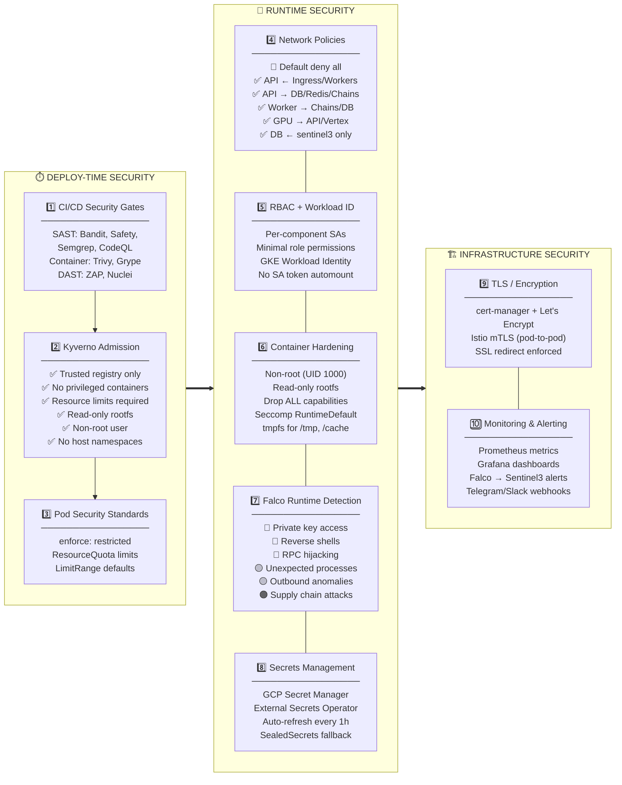
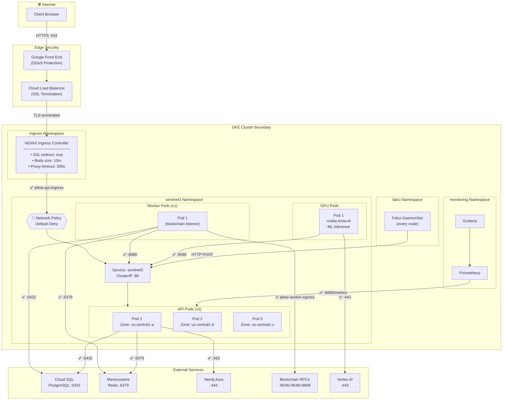

# Sentinel3 — GKE/Kubernetes Security Architecture

## Full Cluster Architecture with Security Layers

```mermaid
graph TB
    %% ============================================================
    %% EXTERNAL ZONE
    %% ============================================================
    subgraph EXTERNAL["☁️ EXTERNAL ZONE"]
        direction TB
        USER["👤 Users / Dashboards<br/>(analytics, cross-chain,<br/>ML-analysis, incidents)"]
        
        subgraph CHAINS["⛓️ Blockchain RPCs"]
            ETH["Ethereum<br/>:8545/:8546"]
            POLY["Polygon<br/>:8545"]
            ARB["Arbitrum<br/>:8545"]
            SOL["Solana<br/>:8899/:8900"]
            APT["Aptos / Sui<br/>NEAR"]
        end
        
        subgraph GCP_MANAGED["🔷 GCP Managed Services"]
            CLOUDSQL["☁️ Cloud SQL<br/>(PostgreSQL)<br/>:5432"]
            MEMSTORE["☁️ Memorystore<br/>(Redis)<br/>:6379"]
            NEO4J["🔵 Neo4j Aura<br/>(Security Graph)<br/>neo4j+s://"]
            VERTEX["🧠 Vertex AI<br/>(ML Serving)"]
            SECRETMGR["🔐 GCP Secret<br/>Manager"]
            ARTIFACT["📦 Artifact<br/>Registry"]
        end
        
        subgraph ALERTS["📢 Alert Channels"]
            TELEGRAM["Telegram Bot"]
            SLACK["Slack Webhook"]
        end
        
        subgraph CICD["🔄 CI/CD Pipeline"]
            GITHUB["GitHub Actions"]
            CLOUDBUILD["Cloud Build"]
        end
    end

    %% ============================================================
    %% GKE CLUSTER
    %% ============================================================
    subgraph GKE["🏗️ GKE CLUSTER"]
        direction TB
        
        %% --- SECURITY LAYER 1: Ingress & TLS ---
        subgraph INGRESS_LAYER["🔒 SECURITY LAYER 1: Ingress + TLS Termination"]
            direction LR
            NGINX["🛡️ NGINX Ingress<br/>Controller"]
            CERTMGR["📜 cert-manager<br/>(Let's Encrypt)"]
            TLS["🔑 TLS Secret<br/>(sentinel3-tls)"]
            CERTMGR --> TLS
            TLS --> NGINX
        end
        
        %% --- SECURITY LAYER 2: Admission Control ---
        subgraph ADMISSION_LAYER["🔒 SECURITY LAYER 2: Admission Control (Kyverno)"]
            direction LR
            KYV1["✅ verify-image-registry<br/>(Artifact Registry only)"]
            KYV2["✅ disallow-privileged<br/>(no privilege escalation)"]
            KYV3["✅ require-resource-limits<br/>(CPU + Memory)"]
            KYV4["✅ require-readonly-rootfs<br/>(immutable containers)"]
            KYV5["✅ disallow-host-namespaces<br/>(no host PID/IPC/Net)"]
            KYV6["✅ require-nonroot<br/>(UID 1000)"]
            KYV7["⚠️ disallow-latest-tag<br/>(audit mode)"]
            KYV8["🏷️ add-security-labels<br/>(auto-label pods)"]
        end
        
        %% --- SENTINEL3 NAMESPACE ---
        subgraph NS["📦 NAMESPACE: sentinel3"]
            direction TB
            
            %% --- SECURITY LAYER 3: Pod Security Standards ---
            subgraph PSS["🔒 SECURITY LAYER 3: Pod Security Standards (Restricted)"]
                direction LR
                PSS_ENFORCE["enforce: restricted"]
                PSS_AUDIT["audit: restricted"]
                PSS_WARN["warn: restricted"]
                QUOTA["ResourceQuota<br/>pods:30 | CPU:40 | Mem:80Gi"]
                LIMITRANGE["LimitRange<br/>max: 8CPU/16Gi per container<br/>default: 1CPU/1Gi"]
            end
            
            %% --- SECURITY LAYER 4: Network Policies ---
            subgraph NETPOL["🔒 SECURITY LAYER 4: Network Policies (Zero-Trust)"]
                direction LR
                DENY_IN["🚫 default-deny-ingress"]
                DENY_OUT["🚫 default-deny-egress"]
            end
            
            %% --- NODE POOL 1: Standard (API + Worker) ---
            subgraph NODEPOOL1["🖥️ NODE POOL: Standard (e2-standard)"]
                direction TB
                
                subgraph API_DEPLOY["Deployment: sentinel3-api (replicas: 3)"]
                    direction TB
                    subgraph API_POD1["Pod: sentinel3-api-xxxxx"]
                        direction TB
                        API1["🐳 Container: sentinel3<br/>Image: sentinel3-gpu<br/>Port: 8080<br/>───────────────<br/>🔒 SecurityContext:<br/>• runAsNonRoot: true<br/>• runAsUser: 1000<br/>• readOnlyRootFilesystem<br/>• drop ALL capabilities<br/>• seccomp: RuntimeDefault<br/>• no privilege escalation<br/>───────────────<br/>📁 Volumes:<br/>• /app/config (RO ConfigMap)<br/>• /app/config/rules (RO)<br/>• /tmp (emptyDir Memory)<br/>• /app/.cache (emptyDir Memory)<br/>───────────────<br/>🏥 Probes:<br/>• startup: /health<br/>• liveness: /health<br/>• readiness: /health"]
                    end
                    API_SA["🔑 SA: sentinel3-api<br/>automount: false<br/>GKE WI: sentinel3-api@"]
                    API_POD1 --- API_SA
                end
                
                subgraph WORKER_DEPLOY["Deployment: sentinel3-worker (replicas: 1)"]
                    direction TB
                    subgraph WORKER_POD1["Pod: sentinel3-worker-xxxxx"]
                        direction TB
                        WORKER1["🐳 Container: sentinel3<br/>Cmd: python -m src.worker.main<br/>Port: 9090<br/>───────────────<br/>🔒 Same SecurityContext<br/>───────────────<br/>📁 Same Volume Mounts<br/>+ /app/data/models (PVC)"]
                    end
                    WORKER_SA["🔑 SA: sentinel3-worker<br/>automount: false<br/>GKE WI: sentinel3-worker@"]
                    WORKER_POD1 --- WORKER_SA
                end
            end
            
            %% --- NODE POOL 2: GPU (ML Inference) ---
            subgraph NODEPOOL2["🎮 NODE POOL: GPU (nvidia-tesla-t4)"]
                direction TB
                
                subgraph GPU_DEPLOY["Deployment: sentinel3-gpu"]
                    direction TB
                    subgraph GPU_POD1["Pod: sentinel3-gpu-xxxxx"]
                        direction TB
                        GPU1["🐳 Container: sentinel3-gpu<br/>Image: nvidia/cuda:12.1<br/>Port: 8000<br/>GPU: 1x nvidia-tesla-t4<br/>Mem: 16Gi | CPU: 4<br/>───────────────<br/>🔒 Same SecurityContext<br/>ML_MODEL_TYPE: transformer<br/>ML_DEVICE: cuda"]
                    end
                    GPU_SA["🔑 SA: sentinel3-gpu<br/>automount: false<br/>GKE WI: sentinel3-ml@"]
                    GPU_POD1 --- GPU_SA
                end
                
                PVC["💾 PVC: sentinel3-models<br/>10Gi (ReadWriteOnce)<br/>ML model storage"]
                GPU_POD1 --> PVC
            end
            
            %% --- Supporting Resources ---
            subgraph SUPPORT["Supporting Resources"]
                direction LR
                SVC["Service: sentinel3<br/>ClusterIP :80 → :8080"]
                HPA["HorizontalPodAutoscaler<br/>min:2 → max:10<br/>CPU:70% | Mem:80%"]
                PDB["PodDisruptionBudget<br/>minAvailable: 1"]
                CM["ConfigMap:<br/>sentinel3-config<br/>sentinel3-chain-config<br/>sentinel3-rules"]
            end
            
            %% --- SECURITY LAYER 5: Secrets Management ---
            subgraph SECRETS_LAYER["🔒 SECURITY LAYER 5: Secrets Management"]
                direction LR
                ESO["External Secrets<br/>Operator"]
                EXTSECRET["ExternalSecret:<br/>sentinel3-db-secrets<br/>refresh: 1h"]
                K8SSECRET["K8s Secret:<br/>sentinel3-secrets<br/>(auto-synced)"]
                SEALED["SealedSecret<br/>(fallback)"]
                ESO --> EXTSECRET
                EXTSECRET --> K8SSECRET
            end
        end
        
        %% --- SECURITY LAYER 6: RBAC ---
        subgraph RBAC_LAYER["🔒 SECURITY LAYER 6: RBAC (Least Privilege)"]
            direction LR
            ROLE_API["Role: sentinel3-api-role<br/>• get ConfigMaps<br/>• get own Pod<br/>• get Secrets"]
            ROLE_WORKER["Role: sentinel3-worker-role<br/>• get ConfigMaps/Secrets<br/>• manage Leases"]
            ROLE_GPU["Role: sentinel3-gpu-role<br/>• get ConfigMaps<br/>• get Secrets"]
            ROLE_MON["ClusterRole:<br/>monitoring-reader<br/>• list pods/svc/endpoints"]
        end
        
        %% --- SECURITY LAYER 7: Runtime Security ---
        subgraph FALCO_LAYER["🔒 SECURITY LAYER 7: Runtime Security (Falco)"]
            direction TB
            subgraph FALCO_NS["Namespace: falco"]
                FALCO["🦅 Falco DaemonSet<br/>(runs on every node)"]
                FALCO_RULES["📜 Custom Rules:<br/>───────────────<br/>🔴 CRITICAL:<br/>• Private Key Access<br/>• Reverse Shell Detection<br/>• RPC Endpoint Hijacking<br/>───────────────<br/>🟡 WARNING:<br/>• Unexpected Process<br/>• Env Secrets Dump<br/>• Unexpected Outbound Conn<br/>───────────────<br/>🟠 ERROR:<br/>• Runtime Package Install<br/>• K8s API Access<br/>• Sensitive Mount Access"]
            end
        end
        
        %% --- MONITORING ---
        subgraph MON_NS["📊 Namespace: monitoring"]
            direction LR
            PROM["Prometheus<br/>:9090<br/>retention: 15d<br/>───────────────<br/>Alert Rules:<br/>• CriticalIncidentDetected<br/>• ChainDisconnected"]
            GRAFANA["Grafana<br/>:3000<br/>Pre-built dashboards"]
            PROM --> GRAFANA
        end
        
        %% --- ISTIO ---
        ISTIO["🔷 Istio Service Mesh<br/>(mTLS between pods)<br/>istio-injection: enabled"]
    end

    %% ============================================================
    %% CI/CD SECURITY PIPELINE
    %% ============================================================
    subgraph PIPELINE["🔒 SECURITY LAYER 8: CI/CD Security Gates"]
        direction LR
        subgraph SAST["SAST Phase"]
            BANDIT["Bandit<br/>(Python SAST)"]
            SAFETY["Safety<br/>(Dep Scan)"]
            SECRETS_SCAN["detect-secrets"]
            SEMGREP["Semgrep"]
            CODEQL["CodeQL"]
            HADOLINT["Hadolint<br/>(Dockerfile)"]
        end
        subgraph CONTAINER_SCAN["Container Scan"]
            TRIVY["Trivy<br/>(CVE Scan)"]
            GRYPE["Grype<br/>(Alt Scanner)"]
        end
        subgraph DAST["DAST Phase"]
            ZAP["OWASP ZAP"]
            APISEC["API Security<br/>Tests"]
            NUCLEI["Nuclei<br/>Scanner"]
        end
        SAST --> CONTAINER_SCAN --> DAST
    end

    %% ============================================================
    %% CONNECTIONS
    %% ============================================================
    
    %% User → Ingress → API
    USER -->|"HTTPS<br/>xdr.example.com"| NGINX
    NGINX -->|":8080"| SVC
    SVC --> API_POD1
    
    %% Network Policy allowed flows
    API_POD1 -->|"NP: allow-api-egress<br/>:5432"| CLOUDSQL
    API_POD1 -->|"NP: allow-api-egress<br/>:6379"| MEMSTORE
    API_POD1 -->|"NP: allow-api-egress<br/>:443"| NEO4J
    API_POD1 -->|"NP: allow-api-egress<br/>:443"| VERTEX
    
    WORKER_POD1 -->|"NP: allow-worker-egress<br/>:8545/:8546/:8899"| CHAINS
    WORKER_POD1 -->|"NP: allow-worker-egress<br/>:5432"| CLOUDSQL
    WORKER_POD1 -->|"NP: allow-worker-egress<br/>:6379"| MEMSTORE
    WORKER_POD1 -->|"NP: allow-worker-egress<br/>:8080"| API_POD1
    
    GPU_POD1 -->|"NP: allow-gpu-egress<br/>:8080"| API_POD1
    GPU_POD1 -->|"NP: allow-gpu-egress<br/>:443"| VERTEX
    
    %% Alerts
    API_POD1 -.->|"Webhook"| TELEGRAM
    API_POD1 -.->|"Webhook"| SLACK
    
    %% Monitoring
    PROM -->|"NP: allow-api-ingress<br/>:8080/metrics"| API_POD1
    
    %% Falco → Sentinel3 (alert correlation)
    FALCO -->|"HTTP POST<br/>/api/v1/security/<br/>falco-alerts"| API_POD1
    FALCO_RULES --> FALCO
    
    %% Secrets flow
    SECRETMGR -->|"Sync every 1h"| ESO
    
    %% RBAC bindings
    API_SA -.->|"RoleBinding"| ROLE_API
    WORKER_SA -.->|"RoleBinding"| ROLE_WORKER
    GPU_SA -.->|"RoleBinding"| ROLE_GPU
    PROM -.->|"ClusterRoleBinding"| ROLE_MON
    
    %% CI/CD
    GITHUB --> PIPELINE
    CLOUDBUILD --> PIPELINE
    PIPELINE -->|"Push verified<br/>image"| ARTIFACT
    ARTIFACT -->|"Kyverno validates<br/>image source"| ADMISSION_LAYER
    
    %% Istio
    ISTIO -.-> NS

    %% ============================================================
    %% STYLES
    %% ============================================================
    classDef external fill:#f9f,stroke:#333,stroke-width:1px
    classDef security fill:#ff6b6b,stroke:#c0392b,stroke-width:2px,color:#fff
    classDef pod fill:#3498db,stroke:#2980b9,stroke-width:1px,color:#fff
    classDef service fill:#2ecc71,stroke:#27ae60,stroke-width:1px,color:#fff
    classDef managed fill:#9b59b6,stroke:#8e44ad,stroke-width:1px,color:#fff
    classDef monitoring fill:#f39c12,stroke:#e67e22,stroke-width:1px,color:#fff
    classDef cicd fill:#1abc9c,stroke:#16a085,stroke-width:1px,color:#fff
    
    class NGINX,CERTMGR,TLS security
    class KYV1,KYV2,KYV3,KYV4,KYV5,KYV6,KYV7,KYV8 security
    class PSS_ENFORCE,PSS_AUDIT,PSS_WARN,QUOTA,LIMITRANGE security
    class DENY_IN,DENY_OUT security
    class FALCO,FALCO_RULES security
    class ESO,EXTSECRET,K8SSECRET,SEALED security
    class ROLE_API,ROLE_WORKER,ROLE_GPU,ROLE_MON security
    class API1,WORKER1,GPU1 pod
    class CLOUDSQL,MEMSTORE,NEO4J,VERTEX,SECRETMGR,ARTIFACT managed
    class PROM,GRAFANA monitoring
    class BANDIT,SAFETY,SECRETS_SCAN,SEMGREP,CODEQL,HADOLINT,TRIVY,GRYPE,ZAP,APISEC,NUCLEI cicd
```

---

## Security Layers — Data Flow Diagram

---

## Network Flow Diagram (with Security Boundaries)

---

## Component Summary Table

| Layer | Component | What It Protects | Enforcement |
|-------|-----------|-----------------|-------------|
| **L1** | NGINX Ingress + cert-manager | TLS termination, SSL redirect, request size limits | Ingress annotations |
| **L2** | Kyverno (8 policies) | Supply chain (image registry), container security posture | Admission webhook (Enforce) |
| **L3** | Pod Security Standards | Namespace-level restricted profile, resource quotas | Namespace labels |
| **L4** | Network Policies (9 rules) | Zero-trust pod-to-pod and egress traffic | CNI enforcement |
| **L5** | RBAC (3 roles + 3 SAs) | Least-privilege API access per component | API server |
| **L6** | Container Hardening | Non-root, read-only rootfs, seccomp, drop capabilities | Pod SecurityContext |
| **L7** | Falco (9 custom rules) | Runtime threats: shells, key theft, RPC hijack | DaemonSet on every node |
| **L8** | External Secrets Operator | Secret rotation, no plaintext in Git | CRD controller |
| **L9** | Istio mTLS | Pod-to-pod encryption | Service mesh sidecar |
| **L10** | CI/CD Gates (SAST+DAST) | Pre-deployment vulnerability scanning | Pipeline enforcement |
